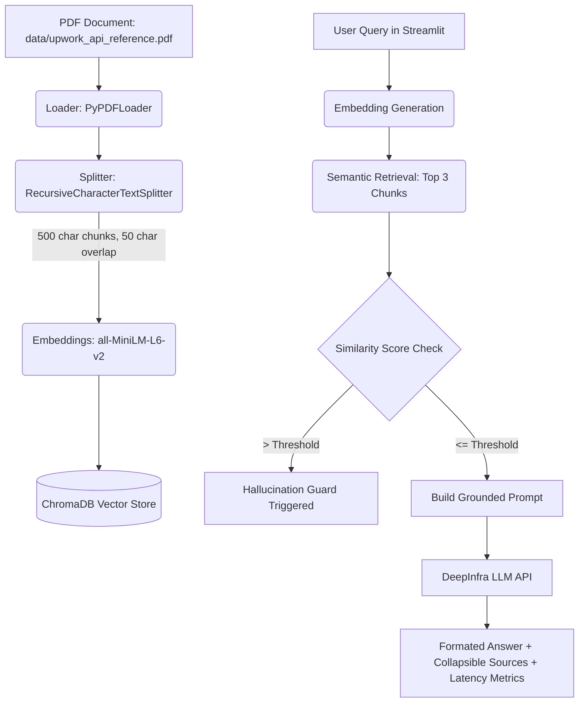
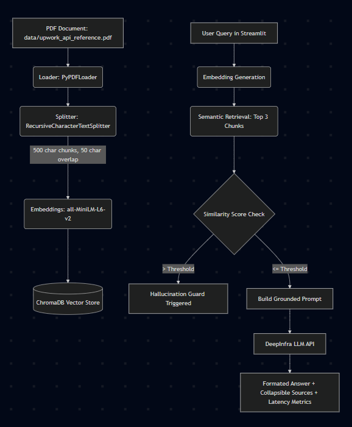

# Technical Summary: AI Technical Support Bot (Upwork API Consultant)

## 1. Project Overview

### Solution Description
This is a solution which is a production-quality **Senior Upwork API Consultant** chatbot. It is a Retrieval-Augmented Generation (RAG) system designed to answer complex developer questions about the Upwork API. To guarantee truthfulness and prevent hallucinations, the bot relies *exclusively* on the provided API documentation and rejects queries that are out-of-scope or lack sufficient documentation context by using a hallucination guard.

### Technologies Used
*   **Framework**: `LangChain`
*   **Vector Database**: `ChromaDB`
*   **Embeddings**: `sentence-transformers/all-MiniLM-L6-v2`
*   **Hosting UI**: `Streamlit`
*   **LLM API**: `DeepInfra` OpenAI-compatible endpoint
*   **Environment Management**: `python-dotenv`

### High-Level Workflow of the RAG Pipeline

---

## 2. Difficulties Faced

*   **ChromaDB Duplicate Indexing (Ingestion Pipeline)**
    *   *Challenge*: In initial runs, repeated executions of `ingest.py` appended duplicate embeddings to the same ChromaDB collection rather than overwriting it, leading to displaying of the identical sources multiple times for a single query.
    *   *Resolution*: Implemented folder cleaning routines (`shutil.rmtree`) in `create_vector_store` to automatically wipe existing collections and rebuild the database from a clean state.
*   **Hallucination Prevention & Threshold Tuning**
    *   *Challenge*: Balancing retrieval confidence so that the chatbot answers valid questions but strictly blocks out-of-scope questions. If the threshold is too low, it will block valid queries, while the threshold is too high it allowed hallucinations.
    *   *Resolution*: Configured normalized embeddings (`normalize_embeddings=True`) to perform Cosine Similarity via L2 distances.
*   **Console Character Encoding Quirks on Windows (`UnicodeEncodeError`)**
    *   *Challenge*: When running the pipeline on Windows environments with a default active console code page, standard log and print statements containing Unicode emoji symbols (such as `📄` or `⚠️`) crashed the execution.
    *   *Resolution*: Removed emoji character literals from CLI print scripts and configured safe logging patterns, while preserving full UTF-8 support inside the Streamlit web browser container.

---

## 3. Chunking Overlap Explanation

### Why a 50-Character Overlap is Critical
When processing documents, text splitters segment long papers at hard character boundaries. A **50-character overlap** (~10% of the 500-character chunk size) acts as a context bridge to retain relevant context.

### Context Preservation
Without an overlap, sentences that cross the 500-character mark would be chopped in half. An overlap ensures that:
*   Any sentence spanning across chunk boundaries is captured in its entirety in at least one of the neighboring chunks.
*   The semantic meaning of transition words, pronouns, and descriptive clauses is not lost.

---

## 4. Use of LLMs (Claude/GPT)

AI tools acted as virtual pair programmers throughout this project, aiding in:
*   **Code Generation & Scaffolding**: Fast-tracking the setup of Streamlit layout containers, responsive orange/black CSS styles, and template boilerplate for HuggingFace loaders.
*   **Debugging & Diagnostics**: Instantly translating Windows stack traces (like the `cp1252` encoding issue or module import mismatches) into structural fixes.
*   **Prompt Design**: Refining the System Prompt to enforce strict context boundaries, ensuring the LLM under no circumstances answers questions using its pre-trained external knowledge.

---

## 5. Why You Are the Best Person for the ProAnalyst AI Team

1.  **Robust RAG Engineering Experience**
    *   I possess hands-on expertise in configuring multi-stage RAG pipelines, including chunking optimizations, custom system prompt boundaries, and metadata indexing in ChromaDB and in a project related to reduction of hallucination using RAG method.
2.  **Rigorous Debugging & System Engineering Mindset**
    *   I don't just write code that works in isolation; I solve environment-level issues (like OS-specific encoding, clean database resets, and library version deprecations) to deliver stable, production-ready software.
3.  **Customer-Centric Focus on Hallucination and UX**
    *   I prioritize user experience metrics—such as showing latency, providing in RAG pipeline granular source attribution with document page numbers, and designing intuitive glassmorphic UIs—while maintaining strict guards to protect business systems from AI hallucinations.
